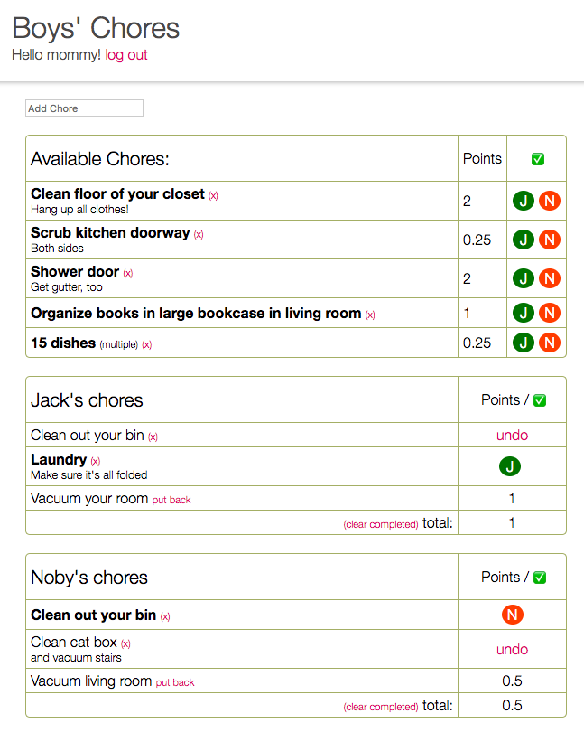
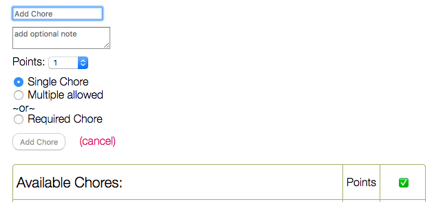
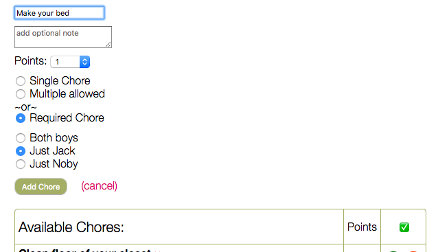

# Boys' Chores

A very helpful app I built for my boys and their chores. 

## Background

Every day the boys each have a couple tasks they need to do (one might need to wash the dishes after, the other might need to fold his laundry) plus I'll tell them they need to do, say, two chores of their choice off a list of chores that need doing. This app makes it so much easier to keep track of everything! 

## Features

**Available Chores:**

At the top is a chart of available chores to choose from and how many points they are worth. If they have to do one chore they can pick one chore worth one point or two chores worth half a point each, etc. When a boy completes one he will click his initial next to the chore and it will show up in his chart below. 

Each boy's chart shows their required chores (chores that still need doing are in bold) and chores they have completed, plus a tally of their points. This makes it very clear to them what they have done and what they still need to do. 

**Adding a chore:**

Clicking inside the "add chore" field pops up the rest of the fields needed to add a chore. Chores can be a one-time chore (like vacuuming the living room) or one that can be done multiple times (like cleaning out one of the bookshelf cubbies). A one-time chore will be deleted from the list of available chores when marked as complete. 

Clicking on "Required Chore" brings up more options. Do both boys need to do it? Just one? These chores will show up inside their own charts.

This site is very easy to use on my phone. If I see something that needs doing I can easily pull out my phone and add that chore to the list of available chores. The boys know to check their charts after school and it's much easier to get them to do chores when they can choose which ones to do. 

All chores and users are stored on Firebase. Right now there's a basic login process but this will be expanded on a little later.

## To Do
* ~~Be able to delete chores from available list~~
* ~~Show notes~~
* ~~Add required chores~~
* ~~Refactor existing code before moving on~~
* ~~Basic authentication~~
* ~~Order available chores by points~~
* Add spinner in a popup when app is loading/saving
* Make chore editable 
* Ability to "start a new day" - erase all their completed chores and undo any completed required chores
* Input somewhere what the daily goal is so when a boy reaches it their chart turns a different color or something
* Add authentication - this will come a little later when I publish the site to the interwebs
  * This also comes along with making some content only visible to me, as opposed to the boys
  * After adding authentication, add ability to deactivate - but not delete - chores. So they aren't active now, but are saved in a grayed out state only I can see for the future